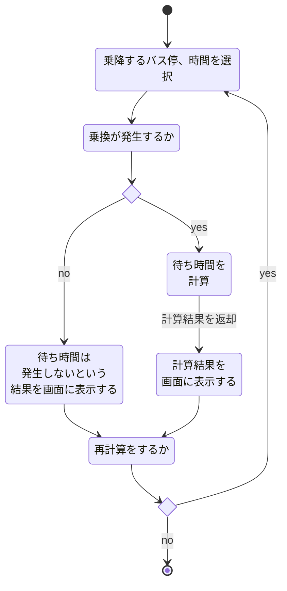
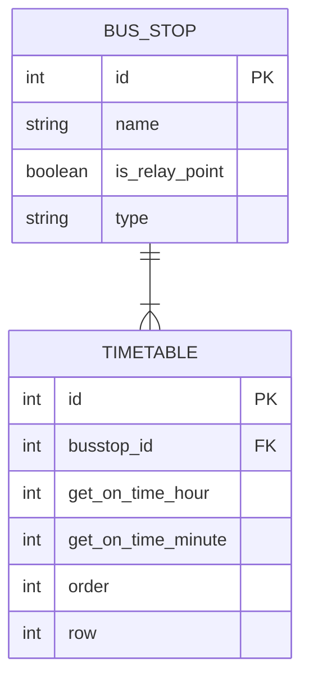

# 図

## アクティビティ図
>開始ノード「●」と終了ノード「◉」を記載し、その間に処理を矢印でつないで記載し、必要に応じて分岐などを記載する。 ステートマシン図と異なり、角丸長方形に書くのは（状態ではなく）処理や動作であることに注意。
https://ja.wikipedia.org/wiki/%E3%82%A2%E3%82%AF%E3%83%86%E3%82%A3%E3%83%93%E3%83%86%E3%82%A3%E5%9B%B3

## ER図
>実体関連モデル（またはERモデル）は、特定の知識領域で相互に関連する関心事を記述します。基本的なERモデルは、エンティティタイプ（関心のあるものを分類する）で構成され、エンティティ（それらのエンティティタイプのインスタンス）間に存在できる関係を指定します。ウィキペディア。
https://mermaid-js.github.io/mermaid/#/entityRelationshipDiagram

